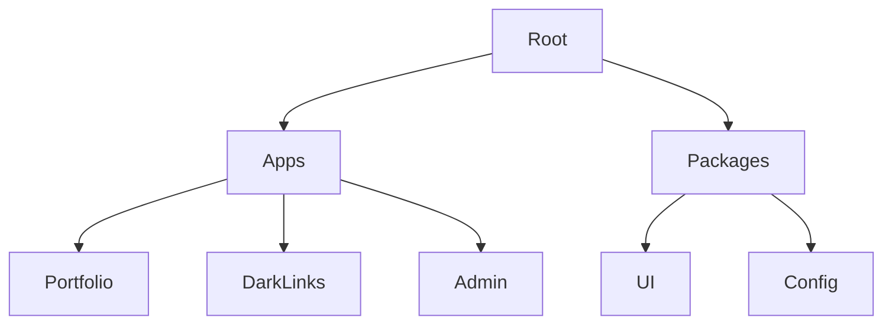

<div align="center">

# DARK ECOSYSTEM
### MONOREPO


<br />

**A unified ecosystem containing my personal portfolio, link-in-bio platform, and administrative dashboard.**
**Managed efficiently with Turborepo.**

[Explore Apps](#-applications) • [Getting Started](#-getting-started) • [License](#-license)

</div>

---

## 🏗️ Architecture

This repository operates as a high-performance Monorepo, leveraging **Turborepo** to orchestrate build systems and operational pipelines across multiple applications.



---

## 🚀 Applications

<div align="center">

| Application | Description | Tech Stack | Port |
|:-----------:|:----------- |:---------- |:----:|
| **[👨‍💻 Portfolio](./apps/portfolio/README.md)** | Personal showcase of projects and skills. | `Next.js` `React 19` `Tailwind` | `3000` |
| **[🔗 Dark Links](./apps/dark-links/README.md)** | High-performance Link-in-Bio platform. | `Next.js` `Supabase` `Analytics` | `3001` |
| **[🛡️ Admin](./apps/admin/README.md)** | Internal CMS for content management. | `Next.js` `RHF` `Supabase Auth` | `3002` |

</div>

---

## 🛠️ Getting Started

### Prerequisites

*   **Node.js 18+**
*   **npm 9+** or **pnpm** (recommended)

### Installation

```bash
# 1. Clone the repository
git clone https://github.com/DionathaGoulart/Dark.git

# 2. Enter the directory
cd Dark

# 3. Install dependencies
npm install
```

### ⚡ Quick Start

Run the entire ecosystem simultaneously:

```bash
npm run dev
```

> This command initializes the local development server for all applications using **Turborepo's** parallel execution engine.

---

## 📄 License

This project is proprietary and confidential.

**Copyright © 2026 Dionatha Goulart.**
All Rights Reserved.
